# Package Registry

- `app` contains the SvelteKit app
- `core` contains the tracker logic
- `extension` contains the VSCode extension
- `plugin-*` contains a plugin for the tracker
- `server` contains the Nitro server
- `shared` includes sub-packages for internal development

```mermaid
%%{init: { "flowchart": { "htmlLabels": true, "curve": "linear" } } }%%
flowchart LR
    subgraph DEMO
        direction RL
        subgraph GitHub API
            ghDB[(repo)]
        end

        subgraph stgit API
            stgitDB[(repo)]
        end

        subgraph WakaTime API
            wtDB[(pulse)]
        end

        subgraph GitHub Plugin
            ghp[[Auth Token\nRepository Name]]
            ghp-->Octokit-->ghDB
        end

        subgraph stgit Plugin
            stgp[[Auth Token\nProject ID]]
            stgp-->Gitbeaker-->stgitDB
        end

        subgraph WakaTime Plugin
            wtp[[Auth Token\nProject Name]]
            wtp-.->wtDB
        end

        subgraph Core
            configparser{{ConfigParser}}
            cli{{CLI Tool}}
            cli --> configparser --> ghp & stgp & wtp
        end

        subgraph Config
            plugins[[Plugin Names]]<-.->pinputs[[Plugin Inputs]]
        end

        Config --> Core

    end

    subgraph App
        direction LR
        subgraph SvelteKit
            subgraph UI
                direction LR
                vscode-webview{{VSCode Webview\nUI Components}}
                chartjs{{Chart.js API}}
            end
            UI-->vite{{"Vite (SSR) +\n Static Adapter"}}
        end

        subgraph Bundler
            direction LR
            fs{{node:fs}}
            cheerio{{cheerio}}
            knitwork{{unjs:knitwork}}
        end

        vite -- jiti --> Bundler
    end

    subgraph Extension
        extContext[[Context:\nGitHub Auth Token\nWakaTime Auth Token\nRepository Name\nProject Name]]
        subgraph Webview
            html{{HTML Content\nwith Context\ninjected in `body`}}
        end

        %% Notifications
        Commands --> Webview
    end

    subgraph Server
        nitro{{nitro/h3/radix3\nroutes}}
        serverDB[(data)]
    end

    DEMO --> App
    App --> Extension
    Extension -- POST data --> Server
    %% wtDB --> Server -- Proxy --> wtp

    %% subgraph ghExtension[GitHub Pull Requests\n& Issues Extension]
    %%     ghLogin[[Login]]
    %% end

    %% subgraph VSCode[Visual Studio Code]
    %%     vsgit{{git}}
    %% end

    %% subgraph wtExtension[WakaTime Extension]
    %%     wtToken[[Token]]
    %% end

    %% ghExtension & VSCode & wtExtension -.-> Extension

```

