```mermaid
%%{init: { "flowchart": { "htmlLabels": true, "curve": "linear" } } }%%
flowchart LR
    subgraph DEMO
        direction RL
        subgraph GitHub API
            ghDB[(repo)]
        end

        subgraph stgit API
            stgitDB[(repo)]
        end

        subgraph WakaTime API
            wtDB[(pulse)]
        end

        subgraph GitHub Plugin
            ghp[[Auth Token\nRepository Name]]
            ghp-->Octokit-->ghDB
        end

        subgraph stgit Plugin
            stgp[[Auth Token\nProject ID]]
            stgp-->Gitbeaker-->stgitDB
        end

        subgraph WakaTime Plugin
            wtp[[Auth Token\nProject Name]]
            wtp-.->wtDB
        end

        subgraph Core
            configparser{{ConfigParser}}
            cli{{CLI Tool}}
            cli --> configparser --> ghp & stgp & wtp
        end

        subgraph Config
            plugins[[Plugin Names]]<-.->pinputs[[Plugin Inputs]]
        end

        Config --> Core

    end

    subgraph App
        direction LR
        subgraph SvelteKit
            subgraph UI
                direction LR
                vscode-webview{{VSCode Webview\nUI Components}}
                chartjs{{Chart.js API}}
            end
            UI-->vite{{"Vite (SSR) +\n Static Adapter"}}
        end

        subgraph Bundler
            direction LR
            fs{{node:fs}}
            cheerio{{cheerio}}
            knitwork{{unjs:knitwork}}
        end

        vite -- jiti --> Bundler
    end

    subgraph Extension
        extContext[[Context:\nGitHub Auth Token\nWakaTime Auth Token\nRepository Name\nProject Name]]
        subgraph Webview
            html{{HTML Content\nwith Context\ninjected in `body`}}
        end

        %% Notifications
        Commands --> Webview
    end

    subgraph Server
        nitro{{nitro/h3/radix3\nroutes}}
        serverDB[(data)]
    end

    DEMO --> App
    App --> Extension
    Extension -- POST data --> Server
    %% wtDB --> Server -- Proxy --> wtp

    %% subgraph ghExtension[GitHub Pull Requests\n& Issues Extension]
    %%     ghLogin[[Login]]
    %% end

    %% subgraph VSCode[Visual Studio Code]
    %%     vsgit{{git}}
    %% end

    %% subgraph wtExtension[WakaTime Extension]
    %%     wtToken[[Token]]
    %% end

    %% ghExtension & VSCode & wtExtension -.-> Extension

```

<!-- PROJECT LOGO -->
 

  

  <h3 align="center">Code Fitness</h3>
  <h4 align="center">Package Registry</h4>

  

  

## app

This package provides the webview interface, responsible for displaying the [UI components](https://github.com/microsoft/vscode-webview-ui-toolkit/), rendering [graphs](https://chartjs.org/) and handling user interactions, for the project. It is built using [SvelteKit](https://kit.svelte.dev/) (with the [static adapter](https://kit.svelte.dev/docs/adapter-static) and [Vite](https://vitejs.dev) bundler) which is turned into function `webview` that returns the content of the template as string ([as desired from VSCode](https://code.visualstudio.com/api/extension-guides/webview#webviews-api-basics)) using a custom script called [`build.ts`](/packages/app/build.ts) that runs using [`jiti`](https://github.com/unjs/jiti) - but the app remains independent of VSCode allowing it to be extended and provided for other platforms.

## core

This package contains the main logic of the project. It is responsible for reading configuration (using [`cosmiconfig`](https://github.com/cosmiconfig/cosmiconfig)<!-- TODO: use unjs/c12 when and if it provides readSync -->), loading plugins with provided inputs, and returning generated graph schema. The environment can be varied based on a configuration file, CLI, etc. Since the project is designed to be modular and extensible, `core` acts as the mediator and other packages can easily integrate with it with the help of [the provided kit utilities](/packages/core/src/kit.ts). The architecture is heavily inspired by [Nuxt3](https://github.com/nuxt/nuxt).

## extension

This package is the Visual Studio Code extension. It uses the `app` package (that also uses `core` under-the-hood) to generate the webview content, getting inputs from the environment (such as `vscode.git` and `wakatime.vscode-wakatime` extensions) that can be toggled from the [Command Palette](https://code.visualstudio.com/docs/getstarted/userinterface#_command-palette). Unlike other packages, this is built using [tsup](https://github.com/egoist/tsup), and uses [vsce](https://github.com/microsoft/vscode-vsce) to manage the extension. At the time of writing, the configuration is hardcoded to use GitHub and WakaTime along with some vendored code (explicitly labelled).

## plugin-github

This package provides a plugin for Code Fitness that enables integration with the [GitHub API](https://docs.github.com/en/rest) allowing repository data to be fetched. It takes the link of the repository (HTTPS atm) and provides `export` & `exportCharts` functions based on information such as commit activity and issues. While authentication is optional, GitHub API Rate Limit must be respected and author token is not provided in the client-side environment, so wherever possible, requests are limited (e.g. only fetching upto 5 recent commits) and/or delegated to [ungh](https://github.com/unjs/ungh). [Shields](https://shields.io) are also provided from the plugin.

## plugin-stgit

This package copies the logic of the GitHub plugin to be translated to *University of Glasgow School of Computing Science Private GitLab Instance* hosted at <https://stgit.dcs.gla.ac.uk>, developed last minute, to expand user study & evaluation. It uses [Gitbeaker](https://github.com/jdalrymple/gitbeaker) for fetching with type-safety, and requires author token to interact with the API.

## plugin-wakatime

This package interacts with the [WakaTime API](https://wakatime.com/developers), and provides information for activity status* and repository timeperiods such as commit activity and issues (requires the GitHub Plugin or equivalent); the returned `export` function adapts the output based on `isChart` from the environment. This is not an official WakaTime plugin, and not intended to be redistributed. Usage, including the name with `-plugin-wakatime`, is internal only. Read Trademark Usage at <https://wakatime.com/legal/logos-and-trademark-usage>.

## server

The server provides many purposes of various types like a database connection, endpoints for data, and proxies for external APIs. The extension makes a POST request to the server to log user activity (such as opening/closing of the dashboard). It is built using [Nitro](https://nitro.unjs.io) with file-based routing, so relatively easier than frameworks like Express, and cheaper to host since it is serverless. Currently deployed on Vercel (free) with storage through Upstash Redis (free).

## shared

Includes shared utilities in the project for development. More details inside.

---

---

